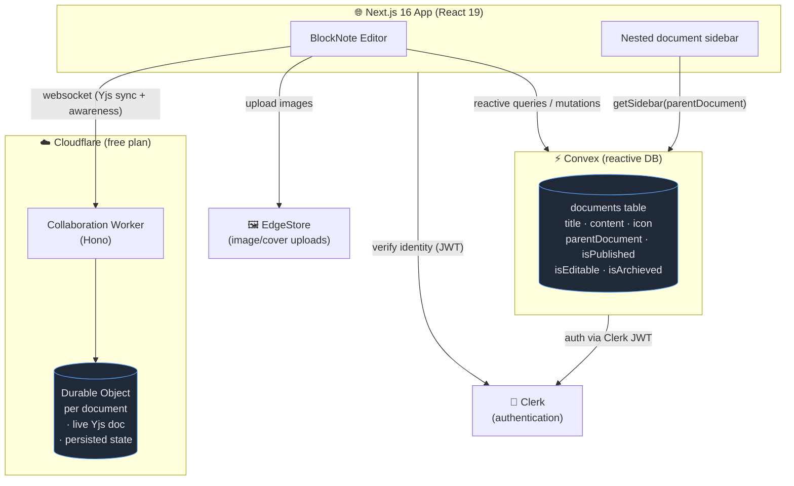
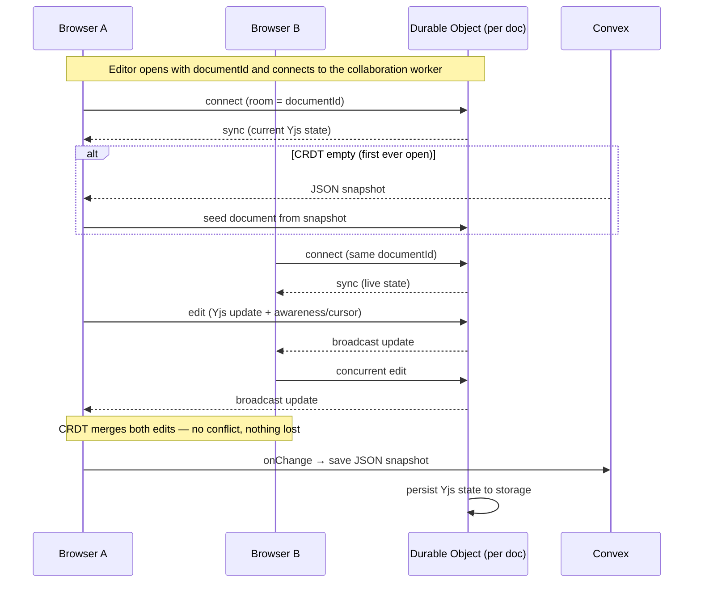
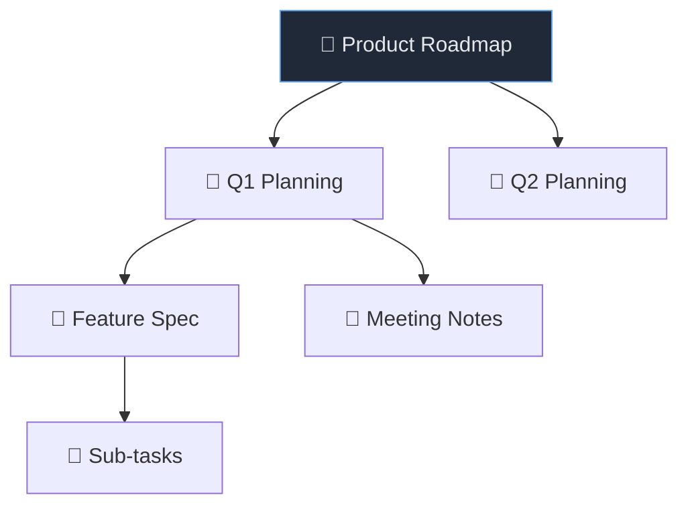

# Notion Lite

A full-stack, real-time collaborative document workspace — a Notion-style editor with infinitely nestable pages, live multiplayer editing powered by CRDTs, publishable public pages, and a self-hosted collaboration backend running on the free tier of Cloudflare's edge.

Built with **Next.js 16 + React 19**, **Convex** for the reactive database, **Clerk** for auth, **BlockNote** for the rich-text editor, and **Yjs + Cloudflare Durable Objects** for conflict-free real-time collaboration.


---

## Highlights

- **Real-time collaborative editing (CRDT)** — multiple people edit the same document simultaneously, with live cursors and presence. Concurrent edits merge automatically and no keystroke is ever lost, using [Yjs](https://yjs.dev) conflict-free replicated data types.
- **Infinitely nested pages** — every note can contain child notes, recursively, with the full tree rendered in a collapsible sidebar (just like Notion).
- **Recursive archive & restore** — archiving a page soft-deletes its entire subtree; restoring brings the whole branch back, intelligently re-parenting orphaned children.
- **Rich block-based editor** — headings, lists, checkboxes, code blocks, image uploads, drag-and-drop blocks, and slash commands via [BlockNote](https://www.blocknotejs.org/).
- **Publish to the web** — turn any document into a public, read-only page accessible without an account.
- **Granular collaboration permissions** — the document owner controls whether a published doc is read-only or openly editable; content can be co-edited while publish/permission state stays owner-only.
- **Cover images, custom emoji icons, full-text search**, light/dark themes, and a fully mobile-responsive layout.
- **Self-hosted, zero-cost backend** — the collaboration server runs on a Cloudflare Worker + SQLite-backed Durable Object, both available on the **free** Workers plan.

---

## Tech Stack

| Layer | Technology |
| --- | --- |
| Framework | [Next.js 16](https://nextjs.org) (App Router), [React 19](https://react.dev) |
| Language | TypeScript |
| Database & backend | [Convex](https://convex.dev) — reactive, real-time serverless DB with end-to-end typed queries/mutations |
| Authentication | [Clerk](https://clerk.com) |
| Editor | [BlockNote](https://www.blocknotejs.org/) (block-based rich text on ProseMirror) |
| Real-time / CRDT | [Yjs](https://yjs.dev) + [`y-websocket`](https://github.com/yjs/y-websocket) client |
| Collaboration server | [Cloudflare Workers](https://developers.cloudflare.com/workers/) + [Durable Objects](https://developers.cloudflare.com/durable-objects/) via [`y-durableobjects`](https://github.com/napolab/y-durableobjects) + [Hono](https://hono.dev) |
| File storage | [EdgeStore](https://edgestore.dev) (image/cover uploads) |
| UI | [Tailwind CSS v4](https://tailwindcss.com), [Radix UI](https://www.radix-ui.com/), [shadcn/ui](https://ui.shadcn.com/), [Mantine](https://mantine.dev), [Lucide](https://lucide.dev) icons |
| State | [Zustand](https://zustand-demo.pmnd.rs/) |
| Tooling | Bun, ESLint (flat config), GitHub Actions CI |

---

## Architecture



The app uses a **dual-persistence model** that keeps single-user simplicity while enabling real-time collaboration:

- **Convex** stores a JSON snapshot of every document's content. This snapshot powers the document list, the public preview page, and seeds a brand-new collaborative session the first time a doc is opened.
- **The CRDT (Yjs) in a Durable Object** is the authoritative live state once collaboration begins. Each document maps to exactly one Durable Object, which holds the in-memory Yjs document, relays updates between connected clients, and persists state to its own storage so it survives restarts and hibernation.

---

## Real-time Collaboration (CRDT)

Collaboration is built on **Yjs**, a CRDT library: concurrent edits from any number of users merge deterministically without a central lock and without conflicts. The backend is a Cloudflare Worker where **each document is a single Durable Object** holding the authoritative live document.



**How the pieces connect:**

- **`collaboration-server/`** — a Cloudflare Worker. [`y-durableobjects`](https://github.com/napolab/y-durableobjects) handles the websocket upgrade, Yjs sync protocol, awareness (cursors/presence), and storage. It speaks the same wire protocol as the `y-websocket` client, and the room name is the `documentId`, so clients connect to `wss://<host>/<documentId>`.
- **`components/editor.tsx`** — when given a `documentId`, the editor opens a Yjs document, connects to the worker, and renders collaborative cursors. The current user's name and a deterministic color are derived from their Clerk identity, so the same person always appears in the same color for everyone.
- **Seeding** — the first time a document is opened collaboratively and the CRDT is empty, the editor seeds it from the Convex snapshot. After that the CRDT is authoritative, so reopening never clobbers live edits.

> See [docs/collaboration.md](docs/collaboration.md) for the full design and local-development guide.

---

## Recursive, Infinitely-Nested Notes

Documents form a tree: each row has an optional `parentDocument` pointing at another document. The sidebar lazily loads each level via `getSidebar(parentDocument)`, so the tree can nest arbitrarily deep.



Operations on the tree are **recursive** (see [`convex/documents.ts`](convex/documents.ts)):

- **Archive** — archiving a page walks its entire subtree and soft-deletes every descendant (`recursiveArchieve`), so a branch disappears as one unit.
- **Restore** — restoring walks the subtree back into the active set (`recursiveRestore`). If a restored page's parent is still archived, it's re-parented to the root so it never becomes orphaned.
- **Trash & permanent delete** — archived documents live in a trash box where they can be restored or permanently removed.

---

## Getting Started

### Prerequisites

- [Bun](https://bun.sh) (or Node.js 20+)
- Accounts for [Convex](https://convex.dev), [Clerk](https://clerk.com), and [EdgeStore](https://edgestore.dev) (all have free tiers)
- A [Cloudflare](https://dash.cloudflare.com) account for collaboration (free plan is sufficient)

### 1. Install & configure

```bash
git clone <repo-url>
cd notion-lite
bun install
cp .env.example .env   # then fill in the values below
```

| Variable | Description |
| --- | --- |
| `NEXT_PUBLIC_CONVEX_URL` | Convex deployment URL |
| `NEXT_PUBLIC_CLERK_PUBLISHABLE_KEY` / `CLERK_SECRET_KEY` | Clerk auth keys |
| `EDGE_STORE_ACCESS_KEY` / `EDGE_STORE_SECRET_KEY` | EdgeStore upload keys |
| `NEXT_PUBLIC_COLLAB_WS_URL` | Collaboration worker URL (defaults to `ws://localhost:8787`) |

### 2. Run the app

```bash
bunx convex dev    # starts Convex (keep running)
bun dev            # starts Next.js on http://localhost:3000
```

### 3. Run the collaboration server (for real-time editing)

```bash
cd collaboration-server
bun install
bun run dev        # wrangler dev → ws://localhost:8787
```

Open the same document in two browser windows to see collaborative editing and live cursors. Full details — including deployment to Cloudflare — are in [docs/collaboration.md](docs/collaboration.md) and [collaboration-server/README.md](collaboration-server/README.md).

---

## Project Structure

```text
notion-lite/
├── app/                      # Next.js App Router
│   ├── (marketing)/          # public landing page
│   ├── (main)/               # authenticated workspace (sidebar, documents)
│   ├── (public)/             # published, shareable read-only pages
│   └── api/edgestore/        # file-upload route
├── components/
│   ├── editor.tsx            # Basic + Collaborative (Yjs) editors
│   ├── toolbar.tsx           # title, icon, cover controls
│   └── ui/                   # shadcn/Radix primitives
├── convex/
│   ├── schema.ts             # documents table + indexes
│   └── documents.ts          # queries/mutations (incl. recursive archive/restore)
├── collaboration-server/     # Cloudflare Worker + Durable Object (Yjs CRDT)
├── hooks/                    # Zustand stores & UI hooks
└── docs/collaboration.md     # CRDT collaboration design doc
```

---

## Engineering Notes & Trade-offs

- **Why Convex + CRDT together?** Convex gives reactive, typed, real-time queries for the document tree and list — ideal for the sidebar, search, and publishing — but it isn't a text-merge engine. Yjs handles character-level concurrent editing. The editor bridges them: Convex stores the canonical snapshot, the Durable Object owns live edits, and snapshots seed new sessions.
- **Why Durable Objects?** They give a single authoritative coordination point per document with built-in persistence and hibernation, eliminating the need for a stateful Node server or external Redis. SQLite-backed Durable Objects run on Cloudflare's **free** plan, keeping the whole stack zero-cost and self-hosted.
- **Permission model** — collaborative documents (`isEditable`) can be content-edited by any authenticated user, but publish/editability state is whitelisted to the owner. The `update` mutation enforces this server-side by filtering to content-only fields for non-owners.
- **Lazy tree loading** — the sidebar fetches one level at a time keyed on `parentDocument`, so deeply nested workspaces stay fast.
- **CI** — every push and PR to `master` runs lint + build via GitHub Actions ([`.github/workflows/quality-check.yml`](.github/workflows/quality-check.yml)) using Bun.

---

## Acknowledgements

Originally inspired by [CodeWithAntonio](https://github.com/AntonioErdeljac)'s Notion clone tutorial, then substantially extended with **self-hosted CRDT real-time collaboration**, a Cloudflare Durable Objects backend, collaboration permissions, and a fully mobile-friendly redesign.
